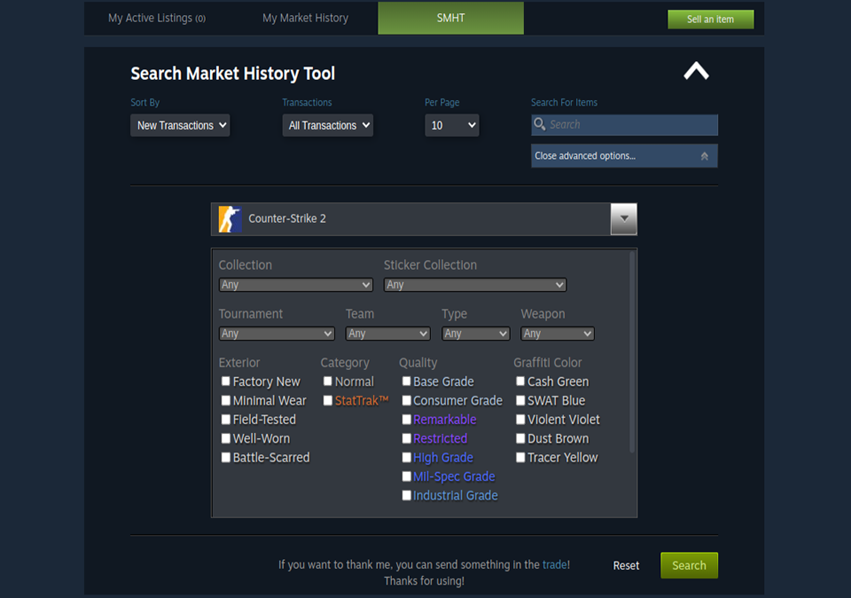
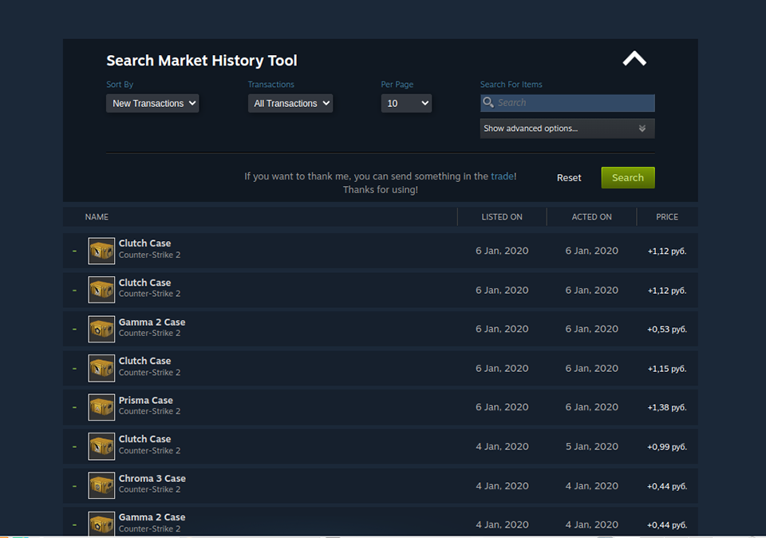
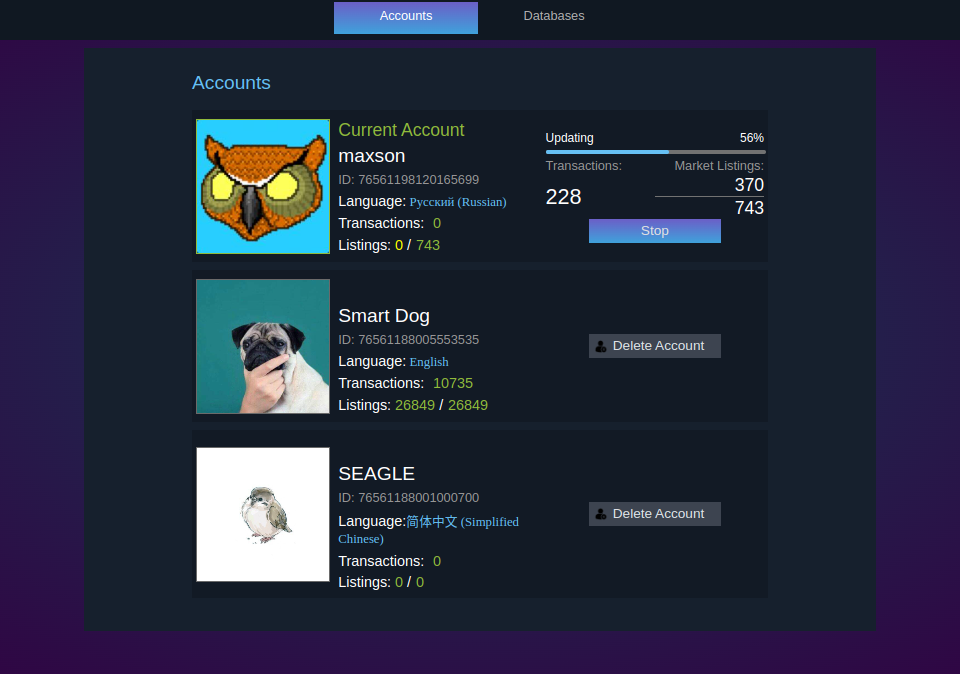
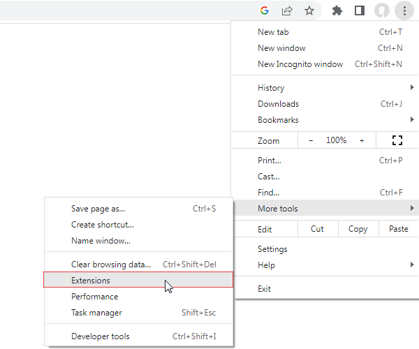
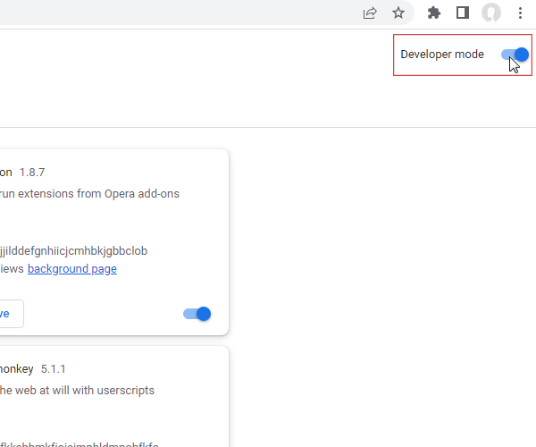
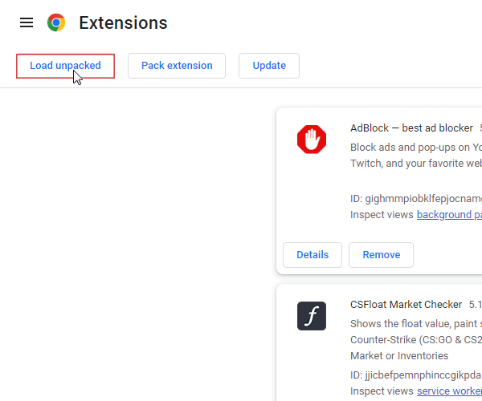
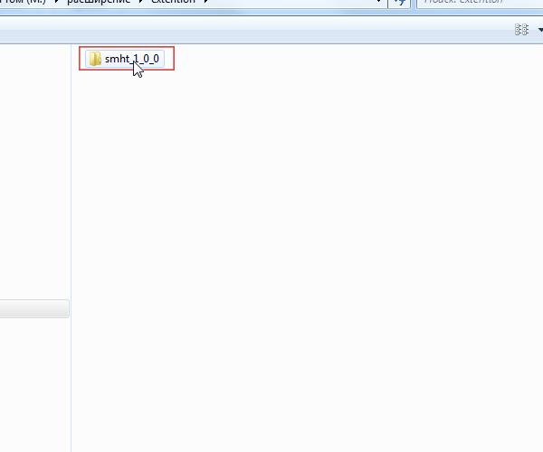
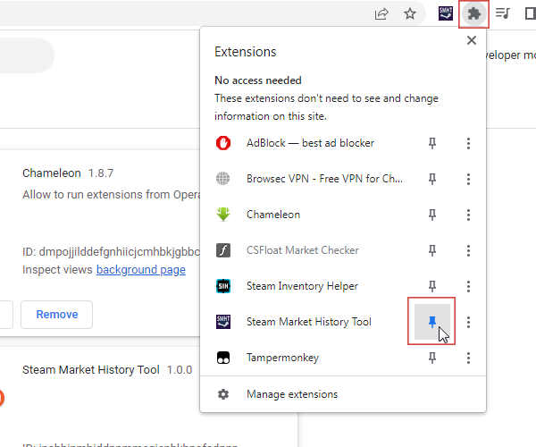

# Steam Market History Tool
Steam Market History Tool(SMHT) is a Chrome extension used for loading and storing your transactions from the **Steam Community Market**. 
The extension downloads transaction data and stores it in your browser's local database. Storing data on a local disk allows you to expand functionality and gives you a new experience of interacting with transactions.

## Key Features
+ **All in one place!** The extension is *integrated* into the [Steam Community Market](https://steamcommunity.com/market/) webpage.
+ Support for multiple accounts and languages.
+ Support the item search filter by **tags**!
+ Displays the full date of transactions.
+ Does not conflict with other extensions for Steam.

## Screenshots

## Installation
1. Open the Chrome Extensions page.

2. Enable **Developer mode**.

3. Download the latest version of **smht_???_pack.zip** the file, where ? is number of version, from [Releases page](https://github.com/MaxsonDev/Steam-Market-History-Tool/releases) and *unpack into a comfortable place for you*.

4. On Chrome Extentions page click on **Load unpacked**.

5. Find unpacked file, click on folder with name **smht_???** and confirm you're choice.

6. The extension is installed! **Do not delete folder after installation! The extension will stop working!**

7. Don't forget pin an extension to the Chrome toolbar.

